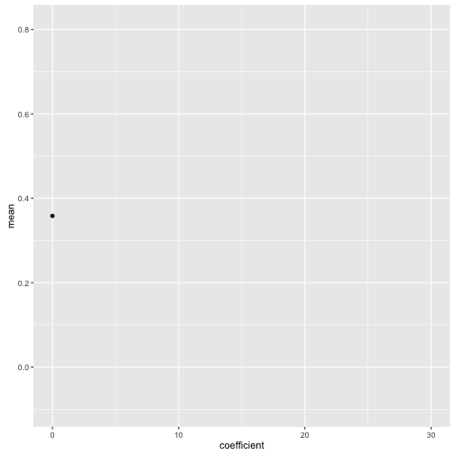

----
title: "Exercises 1-4"
author: "Nandan Rao"
header-includes:
   - \usepackage{mathtools,amsfonts,amssymb, cmbright, bm, commath}
output:
    pdf_document
----

\DeclareMathOperator*{\argmin}{argmin}


```r
library(stats4)
library(ggplot2)
library(dplyr)

dat.raw <- read.csv("synthetic_trimmed.txt", sep=" ", nrows=300)
dat.trim <- dat.raw[, 0:31]
dat.model <- lm(t ~ ., dat.trim)

# Plot parameter estimates and confidence intervals
se <- coef(summary(dat.model))[, 2]
ce <- dat.model$coefficients
dat.estimates <- data.frame(cbind(ce, ce - 1.96 * se, ce + 1.96 * se))
colnames(dat.estimates) <- c("mean", "lower.bound", "upper.bound")
dat.estimates$coefficient = 0:(dim(dat.estimates)[1] - 1)
dat.estimates %>%
    ggplot(aes(x = coefficient, y = mean)) +
    geom_point() +
    geom_pointrange(aes(ymin = lower.bound, ymax = upper.bound))
```

```
## Warning: Removed 30 rows containing missing values (geom_point).
```

```
## Warning: Removed 31 rows containing missing values (geom_pointrange).
```




\section{Slides 3, Exercise 2.3}

We start with our base formula for finding the expectation of a given independent variable, $\hat{t}_n$. We will find that we can plug in our formula for the function $\kappa$ by moving out matrix form and representing the equation as a sum:

\begin{align*}
\hat{t}_n &= \phi(\bm{x}_n)^T W_{bayes} \\
\hat{t}_n &= \phi(\bm{x}_n)^T(\lambda I + \Phi^T\Phi)^{-1}\Phi^Tt \\
\hat{t}_n &= \sum_{k=1}^{N}\phi(\bm{x}_n)^T(\lambda I + \Phi^T\Phi)^{-1}\phi(\bm{x}_k)^Tt_k \\
\hat{t}_n &= \sum_{k=1}^{N} \kappa (\bm{x}_n, \bm{x}_k)t_k \\
\hat{t}_n &= K_n^Tt \\
\hat{t} &= Kt
\end{align*}

Setting $\lambda = 0$, K becomes the Hat matrix we know and love:

\begin{align*}
\hat{t} &= \Phi(\lambda I + \Phi^T\Phi)^{-1}\Phi^Tt \\
\hat{t} &= \Phi(0 + \Phi^T\Phi)^{-1}\Phi^Tt \\
\hat{t} &= \Phi(\Phi^T\Phi)^{-1}\Phi^Tt \\
\hat{t} &= Ht
\end{align*}


\section{Slides 4, Exercise 2.1}

Given a function consisting of scalars $\mu$ and a:
$$
f(\mu) = (\mu - a)^2 + \lambda |\mu|
$$

We can take the derivative (assuming $\mu$ positive, so $|\mu|$ is equal to $\mu$) and set that equal to 0 in order to derive $\mu$ that minimizes $f(\mu)$:

\begin{align*}
f(\mu^+) &= \mu^2 - 2a\mu + a^2 + \lambda\mu \\
f'(\mu^+) &= 2\mu - 2a + \lambda \\
0 &= 2\mu - 2a + \lambda \\
\mu &= a - \frac{\lambda}{2}
\end{align*}

We can now try and do the same for negative $\mu$:

\begin{align*}
f(\mu^-) &= \mu^2 - 2a\mu + a^2 - \lambda\mu \\
f'(\mu^-) &= 2\mu - 2a - \lambda \\
\mu &= a + \frac{\lambda}{2}
\end{align*}

However, if $\mu$ is negative, $a > 0$, and $\lambda > 0$, then this equation is a contradiction. The minimum for $\mu$ cannot, therefore exist in the negative part of $\mu$ as long as both a and $\lambda$ are positive. This leads us to the following equation to describe $\mu$ at all places under these conditions:

$$
\mu = (a - \frac{\lambda}{2})^+
$$

\section{Slides 4, Exercise 2.2}
We start by finding the posterior loglikelihood function as the addition of the distribution loglikelihood function (Normal) and the prior (Laplace).

The multivariate normal distribution with no covariance and identical variance is given by: 

$$
((2\pi)^n*nq^{-1})^{-1/2}exp\bigg\{ \frac{-q}{2}(\bm{w} - t_n)^{T}(\bm{w} - t_n) \bigg\}
$$

Taking the logarithm and dropping the constants that do not have $\bm{w}$, which is what we will be  minimizing in our negative loglikelihood, we arrive at the following familiar Least Squares form:

$$
\argmin_{\bm{w}} \sum_n \frac{q}{2}(\bm{w} - t_n)^{T}(\bm{w} - t_n)
$$

We provide a similar treatment to the Laplace prior with mean 0, the distribution given by: 

$$
\frac{\delta}{2} exp \bigg\{ -\frac{\delta}{2} \sum_i |\bm{w}_i| \bigg\}
$$

Which will reduce to the negative loglikelihood function:

$$
\argmin_{\bm{w}} \frac{\delta}{2} \sum_i |\bm{w}_i|
$$

The sum of absolute values can be further be written in matrix form as the L1 norm: 

$$
\argmin_{\bm{w}} \frac{\delta}{2} \norm{ \bm{w} }_1
$$

This creates the following posterior negative loglikelihood function by combining the two:

$$
\argmin_{\bm{w}} \sum_n \frac{q}{2}(\bm{w} - t_n)^{T}(\bm{w} - t_n) + \frac{\delta}{2} \norm{ \bm{w} }_1
$$

This is consistent with L1 regularization, and consistent with the goal of finding a prior that will allow for sparsity in our weight. To find the minimum analytically we can take the derivative with respect to $\bm{w}$ and set that equal to zero. The derivative of the L1 norm, however, cannot be derived at any zero value. We will address this shortcoming later.

\begin{align*}
0 &= \nabla \bigg(  \sum_n \frac{q}{2}(\bm{w}^T\bm{w} - 2t_n^T\bm{w} - t_n^Tt_n) + \frac{\delta}{2} \norm{ \bm{w} }_1  \bigg) \\
0 &=  \sum_n (q\bm{w} - qt_n) + \frac{\delta}{2} \bigg( \frac{\bm{w} \circ |\bm{w}|^{-1}}{ \norm{ \bm{w}}_1^{0} }  \bigg) \\ 
0 &=  q \sum_n (\bm{w} - t_n) + \frac{\delta}{2} ( \bm{w} \circ |\bm{w}|^{-1} ) \\
0 &=  qn\bm{w} - q\sum_n t_n + \bigg(\frac{\delta}{2} ( \bm{w} \circ |\bm{w}|^{-1} ) \bigg) \\
\bm{w} &=  \frac{1}{n} \sum_n t_n - \bigg( \frac{\delta}{2qn} ( \bm{w} \circ |\bm{w}|^{-1} ) \bigg) \\
  \bm{w} &=  \bar{t} - \frac{\delta}{2qn} ( \bm{w} \circ |\bm{w}|^{-1} )
\end{align*}

Where $\circ$ is defined as the element-wise product. We can see this is unsolvable for all elements of $\bar{t}$ where $\bar{t_n} \leq \frac{\delta}{2qn}$ and $\bar{t_n} \geq \frac{\delta}{2qn}$. Outside that range, this shrinks the absolute value of every element in $\bar{t}$ by $\frac{\delta}{2qn}$ to find the optimum w. We need to isolate w in order to find a closed-form $\bm{w}_{MAP}$ which will require us to restrict our formula to the positive part of w and the negative part of w separately, similar to 2.1, where we did this for positive a. This takes care of the unsolvable section in the middle. We will first define a function $ g(x) $ that takes a scalar, x:

$$
g(x) = 
\begin{cases}
  (x - \frac{\delta}{2qn})^+ , x > 0 \\
  (x + \frac{\delta}{2qn})^- , x < 0 \\
  0, x = 0
\end{cases}
$$

We will then define $h(\bm{x})$ as a function that simply applies g(x) element-wise to a vector $\bm{x}$. We now have a very intuitive definition of $\bm{w}_{MAP}$, which simply shrinks every element of $\bar{t}$ towards our prior mean of 0, by a constant defined as the ratio between the strength of our prior and the size of our sample variance as well as the size of our sample.

$$
  \bm{w}_{MAP} =  h(\bar{t})
$$


\end{document}
