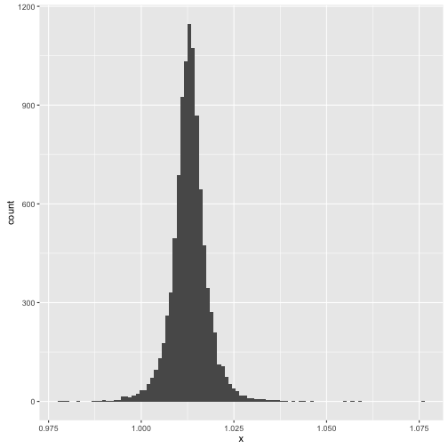
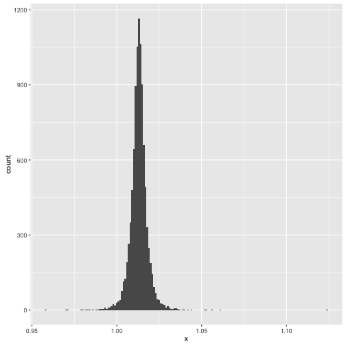
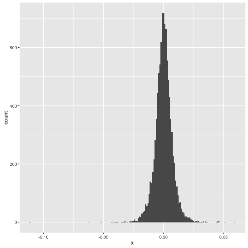

## This is a section about Chickens

Ok here are chicken stats: 


```r
sample.means <- function (n, mu, sigma) {
    alpha <- 1
    beta <- 1
    k <- 1
    precisions <- rgamma(10000, shape = alpha + 32/2, rate = beta + (sigma^2)/2)
    means <- sapply(precisions, function (p) rnorm(1, mean = 1.013, sd = (p^-2)/k))
}


plot.post <- function (means) {
    data.frame(x = means) %>%
        ggplot(aes(x))+
        geom_histogram(binwidth = .001)    
}


means.c <- sample.means(32, 1.013, 0.24)
means.t <- sample.means(36, 1.173, 0.20)


plot.post(means.c)
```



```r
plot.post(means.t)
```



```r
plot.post(means.c - means.t)
```



```r
quantile(means.c - means.t, probs = c(.025, .975))
```

```
##        2.5%       97.5% 
## -0.01467889  0.01450153
```


    
    
